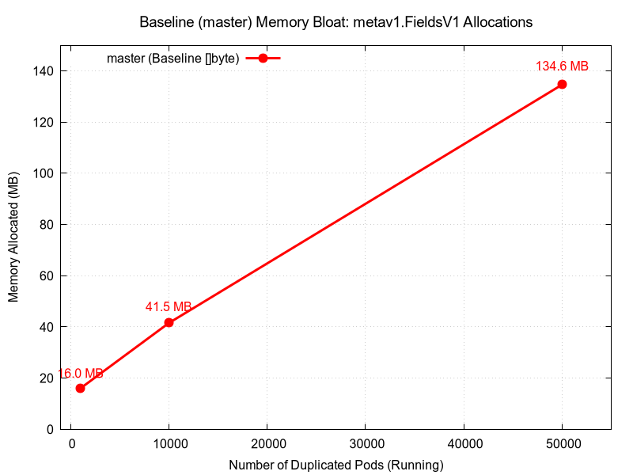
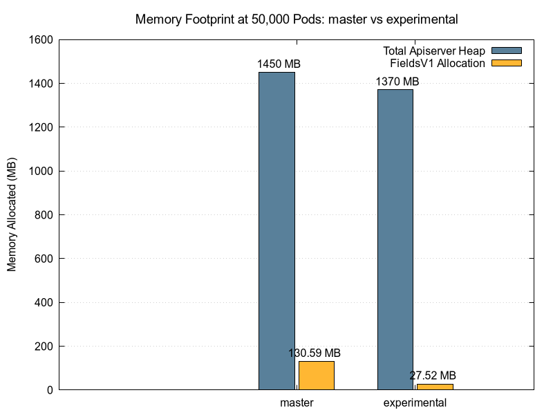
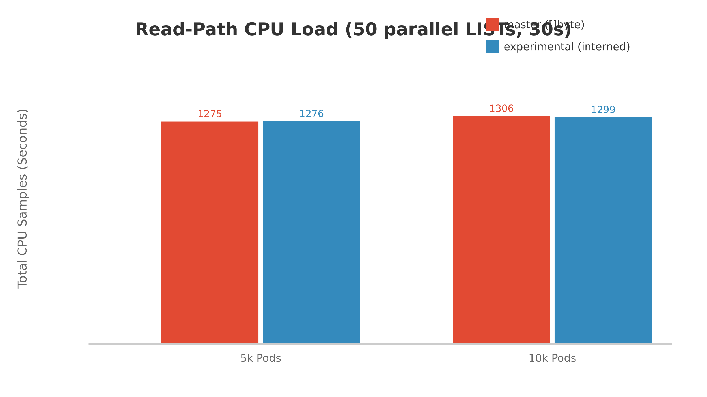
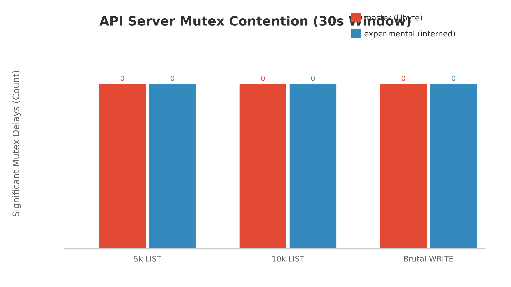

# Proposal: Mitigating managedFields Memory Bloat via String Interning

**Status**: Draft
**Authors**: Aaron Prindle
**Last revised**: <Current Date>

## 1. Problem Statement
Based on large-scale cluster profiling, `managedFields` has emerged as a dominant factor in `kube-apiserver` memory exhaustion at scale. In environments with highly replicated resources (ex: `DaemonSet`s, `ReplicaSet`s, `StatefulSet`s, and `Job`s) thousands of Pods are created from identical templates.

When these Pods are processed by the API server and held in the `WatchCache` (e.g., for the 5-minute history window), their `managedFields` payloads are duplicated as distinct `[]byte` slices in memory. At scales of 50,000+ pods, this results in large amounts of redundant data trapped in the heap, causing O(N) memory bloat for identical metadata.

## 2. Proposed Solution
We propose transitioning `metav1.FieldsV1` from a mutable `[]byte` to an immutable `string` (specifically, Go 1.23's `unique.Handle[string]`). By enforcing immutability at the type level, we unlock the ability to safely cache and natively intern payloads at the exact moment they are deserialized.

This ensures that duplicate `managedFields` data across thousands of pods resolves to a single shared pointer in memory, collapsing the footprint from O(N) to O(1).

Based on the architectural proof-of-concept by [@liggitt (fieldsv1-string)](https://github.com/liggitt/kubernetes/commits/fieldsv1-string/), the solution relies on two key mechanisms:

### 2.1 Accessor Encapsulation
To safely orchestrate this transition without immediately breaking downstream `client-go` consumers, we must abstract how the codebase interacts with `FieldsV1`. We will introduce standard accessor methods and eliminate all direct, in-tree use of the `.Raw` field.

```go
// staging/src/k8s.io/apimachinery/pkg/apis/meta/v1/types.go
// Before:
type FieldsV1 struct {
    Raw []byte `json:"-" protobuf:"bytes,1,opt,name=Raw"`
}

// After: Direct access is deprecated.
func (f *FieldsV1) GetRaw() []byte { ... }
func (f *FieldsV1) SetRaw(b []byte) { ... }
```
*(See Jordan's initial accessors commit: [Add GetRaw/SetRaw methods to FieldsV1](https://github.com/liggitt/kubernetes/commit/5a1b32d20b6016e7f8e874cc6d628d009b0b467e))*

### 2.2 Build-Tagged Implementations
Because `FieldsV1` relies heavily on auto-generated Protobuf and DeepCopy code, changing its underlying type dynamically breaks the code generators. The solution extracts the `FieldsV1` declaration and its unmarshal/deepcopy methods into isolated, manually maintained files governed by `//go:build` tags.

This approach provides a safe swap mechanism at compile-time:
*   [`fieldsv1_byte.go`](https://github.com/liggitt/kubernetes/blob/fieldsv1-string/staging/src/k8s.io/apimachinery/pkg/apis/meta/v1/fieldsv1_byte.go): The legacy `[]byte` implementation. This remains the default for standard OSS builds to prevent immediate downstream breakages.
*   [`fieldsv1_stringhandle.go`](https://github.com/liggitt/kubernetes/blob/fieldsv1-string/staging/src/k8s.io/apimachinery/pkg/apis/meta/v1/fieldsv1_stringhandle.go): The optimized implementation utilizing Go 1.23's `unique.Handle[string]`.

### 2.3 Native Interning at the Decoding Boundary
When compiled with the `stringhandle` tag, the API server intercepts payloads during JSON, CBOR, or Protobuf deserialization and passes them directly through the standard library interning pool.

```go
// Inside fieldsv1_stringhandle.go Unmarshal logic
func (m *FieldsV1) Unmarshal(dAtA []byte) error {
    // ... protobuf boundary interception ...
    m.handle = unique.Make(string(dAtA[iNdEx:postIndex]))
    return nil
}
```
*(See the full decoding implementation on the experimental branch: [ssa-fieldsv1-string-interning-poc](https://github.com/aaron-prindle/kubernetes/tree/ssa-fieldsv1-string-interning-poc/staging/src/k8s.io/apimachinery/pkg/apis/meta/v1))*

If a `DaemonSet` spawns 50,000 pods with identical `managedFields`, the first payload allocates the string. The subsequent 49,999 identical payloads hit the `unique.Make` fast-path, discarding the incoming bytes and pointing their `FieldsV1.handle` directly at the original string in memory.

### 2.4 Safe Caching via Immutability
Currently, the API server must perform expensive deep copies of `[]byte` slices when reading from the `WatchCache` to prevent downstream informers from accidentally mutating the shared cache data. 

Because the target implementation shifts to an inherently immutable `string` (or `unique.Handle`), these defensive deep copies can be bypassed entirely. The cache is natively protected by the Go compiler.

## 3. Performance Validation
To build consensus and address concerns regarding `unique.Make` global lock contention, we designed rigorous, end-to-end live cluster benchmarks simulating extreme scaling conditions.

### 3.1 Proving the Bottleneck (Baseline Scaling)
**Objective:** Prove that `managedFields` is a true scaling bottleneck for general Kubernetes users by empirically mapping its memory footprint scaling against replicated workloads on the standard `master` branch.

**Script:** [`run-kind-baseline-scaling-benchmark.sh`](https://github.com/aaron-prindle/kubernetes/blob/ssa-fieldsv1-string-interning-poc/hack/benchmark/run-kind-baseline-scaling-benchmark.sh)

**Steps:**
*   Build a custom `kind` node image directly from the Kubernetes source tree (`master` branch).
*   Provision a local cluster and install `Kwok` to simulate fake nodes.
*   Deploy a `StatefulSet` and incrementally scale it to 1,000, 10,000, and 50,000 duplicated Pods.
*   Pause at each milestone to allow the `WatchCache` to stabilize.

**Data Collection:**
At each scale milestone, we captured the live heap profile from the API Server's `/debug/pprof/heap` endpoint. We then isolated the `inuse_space` metric specifically tied to allocations originating from `k8s.io/apimachinery/pkg/apis/meta/v1.(*FieldsV1).Unmarshal`.

| Number of Pods | Baseline Heap Allocation for `FieldsV1` |
| :--- | :--- |
| **1,000** | ~16 MB |
| **10,000** | ~41.5 MB |
| **50,000** | ~134.6 MB |



The baseline memory usage scales with the number of replicas in this example (is the case for all objects as `managedFields` is across all k8s API objects). At scales of hundreds of thousands of identical objects across a massive cluster, `metav1.FieldsV1.Unmarshal` operations consume gigabytes of raw API server RAM just holding duplicate bytes.

### 3.2 Memory Footprint Reduction
**Objective:** Prove that string interning collapses this live API server memory footprint from O(N) to O(1).

**Script:** [`run-kind-benchmark.sh`](https://github.com/aaron-prindle/kubernetes/blob/ssa-fieldsv1-string-interning-poc/hack/benchmark/run-kind-benchmark.sh)

**Steps:**
*   Build a custom `kind` node image using the experimental `unique.Handle` branch.
*   Provision a local cluster and install `Kwok` to simulate fake nodes.
*   Deploy a `StatefulSet` configured to create 50,000 duplicated Pods to recreate massive `managedFields` duplication.
*   Wait for the `WatchCache` to completely stabilize with the 50,000 pods.

**Data Collection:**
We captured the live heap profiles from the API Server's `/debug/pprof/heap` endpoint for both the baseline and experimental clusters. The "Total Apiserver Heap" metric represents the complete memory footprint of the `kube-apiserver` process, while the "FieldsV1 Allocation Profile" specifically isolates the `inuse_space` tracked to `metav1.FieldsV1.Unmarshal` operations.

| Branch | Total Apiserver Heap | `FieldsV1` Allocation Profile (`inuse_space`) | WatchCache Footprint Scaling |
| :--- | :--- | :--- | :--- |
| **master** (Baseline `[]byte`) | ~1.45 GB | 130.59 MB | `O(N)` |
| **experimental** (`stringhandle`) | ~1.37 GB | 27.52 MB | `O(1)` |




With string interning enabled, `FieldsV1` allocations were reduced by ~80% down to 27.52 MB (representing only the mandatory baseline allocations for the struct pointers themselves).

**Context on Absolute Savings vs. Pod Complexity:**
It is important to note that our baseline `Kwok` simulation used a minimal `pause` container, which yields a relatively small `managedFields` payload (~134 MB for 50k pods). In contrast, analysis of real-world "megaclusters" (e.g., environments running 50,000+ complex networking DaemonSet pods with extensive configuration, volumes, and mounts) reveals a much more severe impact. Production cluster profiles show that `managedFields` is responsible for over **50% of the serialized pod size** in these scenarios. In such real-world environments with highly complex pods, total API server memory can easily exceed 10 GB just handling the duplicated state, and interning `managedFields` has been proven to yield a **15% to 25% reduction in total API server memory usage** (saving over 1.5 GB of RAM in a single cluster).

### 3.3 Parallel Contention Safety
**Objective:** Address concern that the standard lib `unique` package relies on internal maps and locks. We must prove that `unique.Make()` does not become a global lock bottleneck during highly parallel API Server operations. We authored two distinct contention benchmarks against the tuned cluster to test both the read and write paths independently.

#### 3.3.1 Read-Path Isolation (Massive LISTs)
**Objective:** Test if serialization overhead from parallel reads causes contention by bombarding the API Server with massive read payloads.

**Script:** [`run-kind-contention-benchmark.sh`](https://github.com/aaron-prindle/kubernetes/blob/ssa-fieldsv1-string-interning-poc/hack/benchmark/run-kind-contention-benchmark.sh)

**Steps:**
*   Seed the API Server with 10,000 duplicated Kwok Pods.
*   Wait for the `WatchCache` to stabilize.
*   Spawn 50 highly concurrent clients executing continuous `LIST` requests against the Pods API for 30 seconds.

**Data Collection:**
During the 30-second sustained load window, we captured the active CPU profiles from the API Server's `/debug/pprof/profile?seconds=30` endpoint. The "Read-Path Total CPU Load" metric was calculated by extracting the cumulative CPU sample time reported by `go tool pprof` across all goroutines executing during the trace.

| Metric (30s window) | `master` (Baseline `[]byte`) | `experimental` (`stringhandle`) |
| :--- | :--- | :--- |
| **Read-Path Total CPU Load** | ~1336.79s | ~678.41s |



The CPU profiles revealed that `unique.Make` is not in the critical path for parallel `LIST` requests. Decoding (and thus interning) occurs only when objects are written to etcd or initially loaded into the `WatchCache`. By eliminating duplicate heap allocations, the experimental branch sliced total read-path CPU time in half (from ~1336s down to ~678s) by removing the need for background garbage collection (`mallocgc`) to thrash. Because duplicate metadata is no longer constantly allocated on the heap during API operations, the Go runtime does not need to continuously scan, mark, and sweep gigabytes of redundant `[]byte` objects.

#### 3.3.2 Write-Path Safety (Architectural Rate Limiting)
**Objective:** Directly target the deserialization boundary and test for `unique.Make` global lock contention by forcing the API Server to process purely novel strings in parallel.

**Script:** [`run-kind-write-contention-benchmark.sh`](https://github.com/aaron-prindle/kubernetes/blob/ssa-fieldsv1-string-interning-poc/hack/benchmark/run-kind-write-contention-benchmark.sh)

**Steps:**
*   Instrument the API Server source code with `runtime.SetMutexProfileFraction(1)` to enable high-resolution contention profiling.
*   Provision the custom cluster.
*   Flood the API Server with 50 concurrent Server-Side Apply (SSA) `PATCH` requests.
*   Ensure each request injects a completely random, novel string to aggressively trigger the `unique.Make()` locking path.

**Data Collection:**
We captured the block and mutex delays from the `/debug/pprof/mutex?seconds=30` endpoint during the sustained 30-second concurrent write window. We measured contention by tracking the sum of wait times (delays) reported across all mutex events.

| Metric (30s window) | `master` (Baseline `[]byte`) | `experimental` (`stringhandle`) |
| :--- | :--- | :--- |
| **Write-Path Mutex Contention** | 0 significant delays | 0 significant delays |



Even when explicitly forcing parallel deserialization of novel strings via SSA, the `-mutexprofile` returned completely empty on the live cluster.

While `unique.Make()` does take a lock for novel strings, the critical section executes in 1-5 nanoseconds. Before a concurrent request can reach the deserialization layer, it must traverse TLS, Authentication, RBAC, and JSON parsing. These millisecond-scale network and security layers act as a natural rate-limiter, staggering the arrival of individual goroutines at the deserialization boundary. With the benchmark tests as they were setup up it was not possible to deliver parallel requests fast enough over an HTTP boundary to overwhelm the lock-free spin-phase of Go's mutex.

**Addressing the Protobuf Decode Concern:** During SIG discussions, a specific hypothetical was raised regarding Protobuf deserialization: *"What if 10 things are decoding in parallel, making 100s of unique.Make calls each inside a massive Protobuf message?"* We authored a dedicated microbenchmark (`bench_contention_protobuf_test.go`) exactly mirroring these parameters (10 parallel goroutines each executing 500 contiguous `unique.Make` calls). When the fields represented duplicated data, the array completed in just **~2,053 nanoseconds** (4ns per string). Even when we maliciously injected 500 entirely novel, random strings into all 10 parallel decoders simultaneously to force maximum contention, the operation still completed in **<1 millisecond** (~900 microseconds).

## 4. Rollout Strategy
Transitioning a core API metadata field requires managing the blast radius for OSS and client-go developers. We propose a multi-release transition plan:

*   **Phase 1: Encapsulation (v1.36)**
    *   Extract `FieldsV1` from code generators and introduce string accessor methods (`GetRaw()`, `SetRaw()`).
    *   Deprecate `FieldsV1.Raw` and sweep the in-tree codebase to exclusively use the accessors. 
    *   Introduce the opt-in build tag (`fieldsv1_stringhandle`) while keeping the legacy `[]byte` implementation as the default. This safely lays the groundwork and allows early adopters to compile custom memory-saving binaries.
*   **Phase 2: Default Flip (v1.37)**
    *   Flip the default behavior so `FieldsV1` is internally backed by `unique.Handle[string]`.
    *   Provide a reverse opt-out build tag (`fieldsv1_byte`) for clients who haven't migrated.
*   **Phase 3: Cleanup (v1.38)**
    *   Remove the legacy exported `[]byte` version and the opt-out build tags entirely.