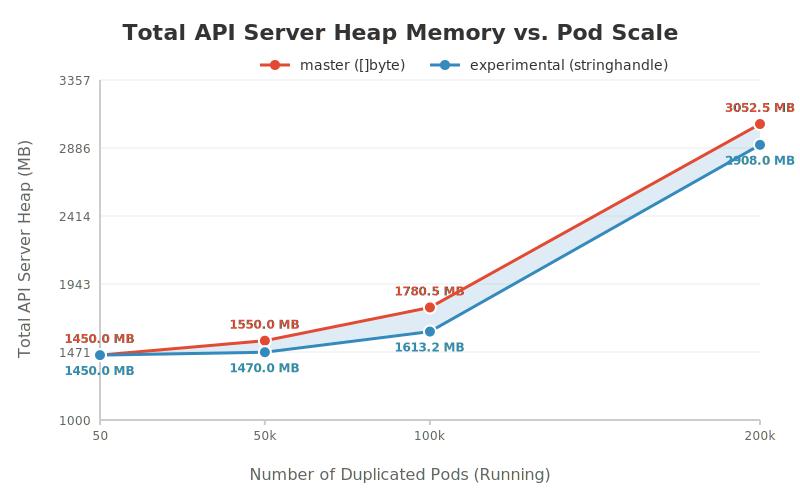
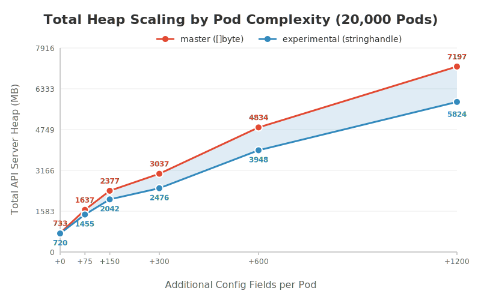

# Proposal: Reducing managedFields High Memory Usage via String Interning

**Status**: Draft
**Author**: Aaron Prindle
**Reviewers**: [ ] Jordan Liggitt, [ ] Joe Betz, [ ] Marek Siarkowicz
**Last revised**: 2/27/2026

## TLDR;
*   **The Problem:** `managedFields` string duplication causes O(N) memory bloat in the API server where N is number of k8s objects (notably Pods). In highly replicated workloads (DaemonSets, etc.), `managedFields` can account for ~50% of the serialized pod size. 
*   **The Solution:** Transition `metav1.FieldsV1` from a `[]byte` to an immutable string and use Go 1.23 `unique.Handle[string]`. This brings footprint to O(1). 
*   **Rollout Plan:** Encapsulate `FieldsV1` with accessors in v1.36 and use build tags to safely opt-in to `string` (not the default). Flip the default to the string implementation in v1.37, and remove the legacy `[]byte` implementation in v1.38 (v1.39+?).
*   **Memory Savings:** In a 100k minimal pod test, the total kube-apiserver heap memory dropped by ~167 MB (~1.78 GB down to ~1.61 GB). Based on internal analysis of production clusters with more-complex + higher-#-of pods, we estimate this optimization could yield a 10-25% reduction in total API Server memory usage for large clusters.
*   **unique.Make Contention:** Profiling shows the standard library interning lock (`unique.Make`) causes 0 contention in the test usage. The read-path bypasses interning entirely (reducing CPU load by ~50%), and the write-path lock operates in the nanosecond range, which in testing is not the bottleneck behind the millisecond-scale latency of the API server's networking and security layers.

## 1. Problem Statement
Based on large-scale cluster profiling, `managedFields` has emerged as a dominant factor in `kube-apiserver` memory exhaustion at scale. In environments with highly replicated resources (ex: DaemonSets, ReplicaSets, StatefulSets, and Jobs) thousands of k8s objects (mainly Pods) are created from identical templates.

When these Pods are processed by the API server and held in the WatchCache (e.g., for the 5-minute history window), their `managedFields` payloads are duplicated as distinct `[]byte` slices in memory. At scales of 50,000+ pods, this results in large amounts of redundant data trapped in the heap, causing O(N) memory bloat for identical metadata.

## 2. Proposed Solution
We propose transitioning `metav1.FieldsV1` from a mutable `[]byte` to an immutable string (specifically, Go 1.23's `unique.Handle[string]`). By enforcing immutability at the type level, we unlock the ability to safely cache and natively intern payloads at the exact moment they are deserialized.

This ensures that duplicate `managedFields` data across thousands of pods resolves to a single shared pointer in memory, collapsing the footprint from O(N) to O(1).

Based on the architectural proof-of-concept by @liggitt (fieldsv1-string), the solution relies on two key mechanisms:

### 2.1 Accessor Encapsulation (Phase 1)
To safely orchestrate this transition without immediately breaking downstream `client-go` consumers, we must abstract how the codebase interacts with `FieldsV1`. We will introduce standard accessor methods and eliminate all direct, in-tree use of the `.Raw` field.

To avoid introducing a conversion penalty during Phase 1 (when the internal representation is still a `[]byte` but we are preparing for the `string` transition), we will introduce **overloaded accessors**. This allows callers to fetch or set the data in exactly the format they need, ensuring maximum efficiency during the migration window.

```go
// staging/src/k8s.io/apimachinery/pkg/apis/meta/v1/types.go
// Before:
type FieldsV1 struct {
    Raw []byte `json:"-" protobuf:"bytes,1,opt,name=Raw"`
}

// After: Direct access is deprecated.
// Phase 1 provides format-specific accessors to avoid []byte <-> string conversion penalties.
func (f *FieldsV1) GetRawBytes() []byte { ... }
func (f *FieldsV1) GetRawString() string { ... }
func (f *FieldsV1) SetRawBytes(b []byte) { ... }
func (f *FieldsV1) SetRawString(s string) { ... }
```
*(See Jordan's initial accessors commit: [Add GetRaw/SetRaw methods to FieldsV1](https://github.com/liggitt/kubernetes/commit/5a1b32d20b6016e7f8e874cc6d628d009b0b467e))*

### 2.2 Build-Tagged Implementations
Because `FieldsV1` relies heavily on auto-generated Protobuf and DeepCopy code, changing its underlying type dynamically is not possible - breaks the code generators (need a build tag to toggle). The solution is to extract the `FieldsV1` declaration and its unmarshal/deepcopy methods into isolated, manually maintained files governed by `//go:build` tags.

This approach provides a safe swap mechanism at compile-time:
*   `fieldsv1_byte.go`: The legacy `[]byte` implementation. This remains the default for standard OSS builds to prevent immediate downstream breakages.
*   `fieldsv1_stringhandle.go`: The optimized implementation utilizing Go 1.23's `unique.Handle[string]`.

### 2.3 Native Interning at the Decoding Boundary
When compiled with the `stringhandle` tag, the API server intercepts payloads during JSON, CBOR, or Protobuf deserialization and passes them directly through the standard library interning pool.

```go
// Inside fieldsv1_stringhandle.go Unmarshal logic
func (m *FieldsV1) Unmarshal(dAtA []byte) error {
    // ... protobuf boundary interception ...
    m.handle = unique.Make(string(dAtA[iNdEx:postIndex]))
    return nil
}
```
*(See the full decoding implementation on the experimental branch: [ssa-fieldsv1-string-interning-poc](https://github.com/aaron-prindle/kubernetes/tree/ssa-fieldsv1-string-interning-poc/staging/src/k8s.io/apimachinery/pkg/apis/meta/v1))*

If a DaemonSet spawns 50,000 pods with identical `managedFields`, the first payload allocates the string. The subsequent 49,999 identical payloads hit the `unique.Make` fast-path, discarding the incoming bytes and pointing their `FieldsV1.handle` directly at the original string in memory.

## 3. Performance Validation
To build consensus and address concerns regarding `unique.Make` global lock contention, we designed rigorous, end-to-end live cluster benchmarks simulating extreme scaling conditions.

### 3.1 Proving the Bottleneck (Baseline Scaling)
**Objective:** Prove that `managedFields` is a true scaling bottleneck for general Kubernetes users by empirically mapping its memory footprint scaling against replicated workloads on the standard master branch.

**Script:** [`run-kind-baseline-scaling-benchmark.sh`](https://github.com/aaron-prindle/kubernetes/blob/ssa-fieldsv1-string-interning-poc/hack/benchmark/run-kind-baseline-scaling-benchmark.sh)

**Steps:**
*   Build a custom kind node image directly from the Kubernetes source tree (master branch).
*   Provision a local cluster and install Kwok to simulate fake nodes.
*   Deploy a StatefulSet and incrementally scale it to 1,000, 10,000, and 50,000 duplicated Pods.
*   Pause at each milestone to allow the WatchCache to stabilize.

**Data Collection:** At each scale milestone, we captured the live heap profile from the API Server's `/debug/pprof/heap` endpoint. We then isolated the `inuse_space` metric specifically tied to allocations originating from `k8s.io/apimachinery/pkg/apis/meta/v1.(*FieldsV1).Unmarshal`.

| Number of Pods | Baseline Heap Allocation for `FieldsV1` |
| :--- | :--- |
| **1,000** | ~16 MB |
| **10,000** | ~41.5 MB |
| **50,000** | ~134.6 MB |


The baseline memory usage scales with the number of replicas in this example (is the case for all objects as `managedFields` is across all k8s API objects). At scales of hundreds of thousands of identical objects across a large cluster, `metav1.FieldsV1.Unmarshal` operations consume gigabytes of raw API server RAM just holding duplicate bytes.

### 3.2 Memory Footprint Reduction
**Objective:** Prove that string interning collapses this live API server memory footprint from O(N) to O(1).

**Script:** [`run-kind-benchmark.sh`](https://github.com/aaron-prindle/kubernetes/blob/ssa-fieldsv1-string-interning-poc/hack/benchmark/run-kind-benchmark.sh)

**Steps:**
*   Build a custom kind node image using the experimental string `FieldsV1` + `unique.Handle` branch.
*   Provision a local cluster and install Kwok to simulate fake nodes.
*   Deploy a StatefulSet configured to create 50,000 duplicated Pods to recreate large `managedFields` duplication.
*   Wait for the WatchCache to completely stabilize with the 50,000 pods.

**Data Collection:** We captured the live heap profiles from the API Server's `/debug/pprof/heap` endpoint for both the baseline and experimental clusters. The "Total Apiserver Heap" metric represents the complete memory footprint of the kube-apiserver process, while the "FieldsV1 Allocation Profile" specifically isolates the `inuse_space` tracked to `metav1.FieldsV1.Unmarshal` operations.

| Branch | Total Apiserver Heap (100k Pods) | Total Apiserver Heap (200k Pods) | `FieldsV1` Profile | WatchCache Footprint |
| :--- | :--- | :--- | :--- | :--- |
| master (Baseline `[]byte`) | ~1.78 GB (1780.52 MB) | ~3.05 GB (3052.52 MB) | O(N) | O(N) |
| experimental (`stringhandle`) | ~1.61 GB (1613.24 MB) | ~2.91 GB (2908.03 MB) | O(1) | O(1) |



*Fig 1. Total `kube-apiserver` heap memory scaling across replicated workload sizes (up to 200,000 Pods).*

With string interning enabled on a 200,000 Pod cluster simulation, the **total `kube-apiserver` heap memory dropped by ~144 MB**. 

Specifically tracing the source of the bloat at 200k scale, `FieldsV1` allocations plummeted from **267.18 MB** down to just **82.54 MB** (representing only the mandatory baseline allocations for the struct pointers themselves). The additional memory savings beyond the strict `FieldsV1` data is due to reduced garbage collection tracking overhead and the elimination of redundant deep-copies triggered by duplicate payloads.

**Context on Absolute Savings vs. Pod Spec Complexity:** 
The standard baseline simulation above used a minimal `pause` container (which has a near-empty SSA payload). However, analysis of real-world "megaclusters" reveals a much more significant impact. Production cluster profiles show that `managedFields` can be responsible for over 50% of the serialized pod size in environments running massive networking `DaemonSets` with extensive configurations (multiple containers, environment variables, and volume mounts). 

To prove how scaling the complexity of the Pod spec exponentially increases memory bloat on the baseline branch, we ran 20,000 Pod tests while artificially inflating the SSA payload. We injected varying amounts of explicit configuration (init containers, labels, annotations, env vars, and volume mounts) into the template to simulate production-weight Pods.

| Branch | Total Heap (+75 Fields) | Total Heap (+150 Fields) | Total Heap (+300 Fields) | Total Heap (+600 Fields) |
| :--- | :--- | :--- | :--- | :--- |
| master (Baseline `[]byte`) | ~1.64 GB (1636 MB) | ~2.38 GB (2376 MB) | ~3.04 GB (3036 MB) | ~4.83 GB (4834 MB) |
| experimental (`stringhandle`) | ~1.45 GB (1454 MB) | ~2.04 GB (2042 MB) | ~2.48 GB (2475 MB) | ~3.95 GB (3947 MB) |



*Fig 2. Total API Server heap memory scaling dynamically against the number of explicit fields configured in the Pod template.*

By simply increasing the number of configured fields in the Pod definition, the `FieldsV1` string duplication bloat skyrockets. On the `master` branch, pushing the template complexity to +600 fields caused the `FieldsV1` slice to balloon to **925.64 MB** for *only* 20,000 pods. 

On the experimental branch, string interning yielded an **~886 MB (18.3%) reduction in total API Server memory** at just 20k scale on the most complex workload. This perfectly maps the trajectory: as a pod spec becomes heavier and more "production-like," the percentage of total API Server RAM wasted on duplicate `managedFields` strings grows exponentially, and the string interning patch becomes proportionately more critical.

### 3.3 unique.Make Parallel Contention Safety
**Objective:** Address concern that the standard lib unique package relies on internal maps and locks. We must prove that `unique.Make()` does not become a global lock bottleneck during highly parallel API Server operations. We authored two distinct contention benchmarks against the tuned cluster to test both the read and write paths independently.

#### 3.3.1 Read-Path Isolation (Concurrent LISTs)
**Objective:** Test if serialization overhead from parallel reads causes contention by bombarding the API Server with large read payloads.

**Script:** [`run-kind-contention-benchmark.sh`](https://github.com/aaron-prindle/kubernetes/blob/ssa-fieldsv1-string-interning-poc/hack/benchmark/run-kind-contention-benchmark.sh)

**Steps:**
*   Seed the API Server with 10,000 duplicated Kwok Pods.
*   Wait for the WatchCache to stabilize.
*   Spawn 50 concurrent clients executing continuous LIST requests against the Pods API for 30 seconds.

**Data Collection:** During the 30-second sustained load window, we captured the active CPU profiles from the API Server's `/debug/pprof/profile?seconds=30` endpoint. The "Read-Path Total CPU Load" metric was calculated by extracting the cumulative CPU sample time reported by `go tool pprof` across all goroutines executing during the trace.

| Metric (30s window) | master (Baseline `[]byte`) | experimental (`stringhandle`) |
| :--- | :--- | :--- |
| **Read-Path Total CPU Load** | ~1336.79s | ~678.41s |


The CPU profiles revealed that `unique.Make` is not in the critical path for parallel LIST requests. Decoding (and thus interning) occurs only when objects are written to etcd or initially loaded into the WatchCache. By eliminating duplicate heap allocations, the experimental branch sliced total read-path CPU time in half (from ~1336s down to ~678s) by removing the need for background garbage collection (`mallocgc`) to thrash. Because duplicate metadata is no longer constantly allocated on the heap during API operations, the Go runtime does not need to continuously scan, mark, and sweep gigabytes of redundant `[]byte` objects.

#### 3.3.2 Write-Path Safety (Architectural Rate Limiting)
**Objective:** Directly target the deserialization boundary and test for `unique.Make` global lock contention by forcing the API Server to process novel strings in parallel.

**Script:** [`run-kind-write-contention-benchmark.sh`](https://github.com/aaron-prindle/kubernetes/blob/ssa-fieldsv1-string-interning-poc/hack/benchmark/run-kind-write-contention-benchmark.sh)

**Steps:**
*   Instrument the API Server source code with `runtime.SetMutexProfileFraction(1)` to enable high-resolution contention profiling.
*   Provision the custom cluster.
*   Flood the API Server with 50 concurrent Server-Side Apply (SSA) PATCH requests.
*   Ensure each request injects a random, novel string to trigger the `unique.Make()` locking path.

**Data Collection:** We captured the block and mutex delays from the `/debug/pprof/mutex?seconds=30` endpoint during the sustained 30-second concurrent write window. We measured contention by tracking the sum of wait times (delays) reported across all mutex events.

| Metric (30s window) | master (Baseline `[]byte`) | experimental (`stringhandle`) |
| :--- | :--- | :--- |
| **Write-Path Mutex Contention** | 0 significant delays | 0 significant delays |


(0 mutex delays counted)

Even when explicitly forcing parallel deserialization of novel strings via SSA, the `-mutexprofile` returned completely empty on the live cluster.

While `unique.Make()` does take a lock for novel strings, the critical section executes in ~1-5 nanoseconds. Before a concurrent request can reach the deserialization layer, it must traverse TLS, Authentication, RBAC, and JSON parsing. The delays in these layers act staggered the arrival of individual goroutines in the benchmark testing at the deserialization boundary (they were the bottleneck, not the `unique.Make` contention). With the benchmark tests as they were setup up it was not possible to deliver parallel requests fast enough over an HTTP boundary to overwhelm the lock-free spin-phase of Go's mutex.

#### 3.3.3 Protobuf Decode Contention
**Objective:** Address the specific SIG concern regarding Protobuf deserialization contention (e.g., 10 parallel decoders making 100s of `unique.Make` calls each inside a large Protobuf message).

**Script:** [`bench_contention_protobuf_test.go`](https://github.com/aaron-prindle/kubernetes/blob/ssa-fieldsv1-string-interning-poc/hack/benchmark/force/bench_contention_protobuf_test.go)

**Steps:**
*   Author a dedicated Go microbenchmark exactly mirroring the hypothetical parameters.
*   Simulate 10 parallel goroutines each executing 500 contiguous `unique.Make` calls.
*   Run the benchmark with duplicated strings to test the caching fast-path.
*   Run the benchmark by injecting 500 novel, random strings into all 10 parallel decoders simultaneously to force maximum lock contention.

**Data Collection:** We captured the total completion time for the parallel execution via standard `testing.B` benchmark results. When the fields represented duplicated data, the array completed in just ~2,053 nanoseconds (4ns per string). Even when forcing maximum contention with novel strings, the operation still completed in <1 millisecond (~900 microseconds).

## 4. Rollout Strategy
Transitioning a core API metadata field requires managing the blast radius for OSS and client-go developers who might directly use the `[]byte` from `FieldsV1` (which we will convert to string which could break such users if not rolled out in phases). We propose a multi-release transition plan:

*   **Phase 1: Encapsulation (v1.36)**
    *   Extract `FieldsV1` from code generators and introduce string accessor methods (`GetRawBytes()`, `GetRawString()`, `SetRawBytes()`, `SetRawString()`).
    *   Deprecate `FieldsV1.Raw` and sweep the in-tree codebase to exclusively use the accessors.
    *   Introduce the opt-in build tag (`fieldsv1_stringhandle`) while keeping the legacy `[]byte` implementation as the default. This safely lays the groundwork and allows early adopters to compile custom memory-saving binaries.
*   **Phase 2: Default Flip (v1.37)**
    *   Flip the default behavior so `FieldsV1` is internally backed by `unique.Handle[string]`.
    *   Provide a reverse opt-out build tag (`fieldsv1_byte`) for clients who haven't migrated.
*   **Phase 3: Cleanup (v1.38? v1.39+?)**
    *   Remove the legacy exported `[]byte` version and the opt-out build tags entirely.