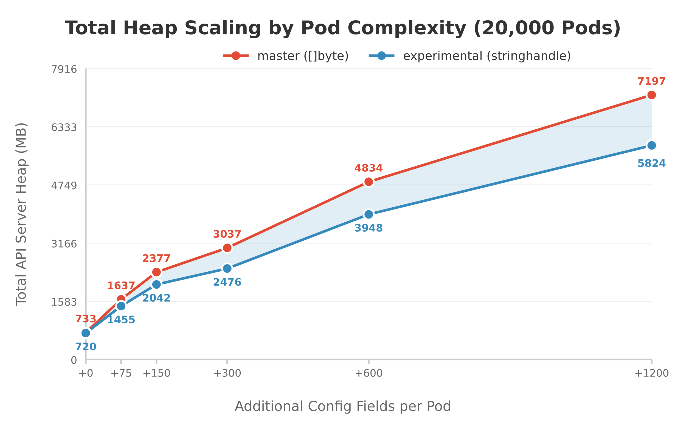
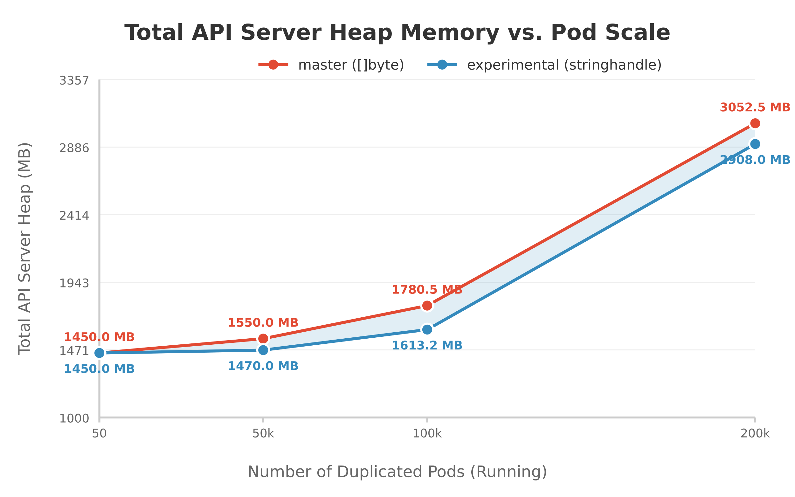

# Proposal: Reducing managedFields High Memory Usage via String Interning

**Status**: Draft
**Author**: Aaron Prindle
**Reviewers**: [ ] Jordan Liggitt, [ ] Joe Betz, [ ] Marek Siarkowicz
**Last revised**: 3/3/2026

## TLDR;
*   **The Problem:** `managedFields` string duplication causes O(N) memory bloat in the API server where N is the number of fields in `managedFields` as part of a k8s objects (notably Pods). In highly replicated workloads (DaemonSets, etc.), `managedFields` can account for ~50% of the serialized pod size. 
*   **The Solution:** Transition `metav1.FieldsV1` from a `[]byte` to an immutable string and use Go 1.23 `unique.Handle[string]`. This removes the duplicated `managedFields` from api-server. 
*   **Rollout Plan:** 
    *   **v1.36**: Encapsulate `FieldsV1` with accessors and use build tags to safely opt-in to `string` (not the default). 
    *   **v1.37**: Flip the default to the string implementation.
    *   **v1.38 (v1.39+?)**: Remove the legacy `[]byte` implementation.
*   **Memory Savings:** Memory savings are directly proportional to the size (number of fields, labels, annotations, etc.) of the k8s object that is duplicated. The figure on the left below shows if we have a 20k code cluster, as we scale the # of config fields per Pod, the memory reduction interning yields is greater. In the benchmarking done we see **15-20% reduction** in total API Server memory usage for the “complex” Pod configuration cases (600-1200 additional fields) representative of actual complex Pods from the clusters we analyzed. The graph on the right shows that as we increase the # of pods, the `managedFields` difference stays constant proportionally to the # of fields (eg: X% savings maintain at 10k pods and 100k pods depending on pod complexity).

<p align="center">
  
  
</p>

*   **unique.Make Contention:** Profiling shows the standard library interning (`unique.Make`) lock implementation causes 0 contention in the benchmark tests which attempted a burst of CREATEs with unique values (where the lock is held per write). The read-path bypasses interning entirely (notably reducing CPU load by ~50%), and the write-path lock operates so fast in testing (nanosecond range), it is not the bottleneck behind the ~millisecond-scale latency of the API server's networking and security layers.

## 1. Problem Statement
From large-scale cluster profiling, `managedFields` has emerged as a dominant factor in `kube-apiserver` memory exhaustion. In environments with highly replicated resources (ex: DaemonSets, ReplicaSets, StatefulSets, and Jobs) thousands of k8s objects (mainly Pods) are created from identical templates.

When these Pods are processed by the API server and held in the WatchCache (eg: for the 5-minute history window), their `managedFields` payloads are duplicated as distinct `[]byte` slices in memory. At scales of 50,000+ pods, this results in large amounts of redundant data trapped in the heap, causing O(N) memory bloat for identical metadata.

## 2. Proposed Solution - Convert FieldsV1 to string + string Interning 
We propose transitioning `metav1.FieldsV1` from a mutable `[]byte` to an immutable string. We would then intern this string (specifically, Go 1.23's `unique.Handle[string]`) to deduplicate `managedField` values across the kube-api-server. By enforcing immutability at the type level (via string), we unlock the ability to safely cache and natively intern payloads when they are deserialized.

The solution relies on three key parts (based on initial PoC by @liggitt (fieldsv1-string)):

### 2.1 Accessor Encapsulation (internal representation is still []byte)
To do the conversion without breaking downstream `client-go` consumers, we can abstract how the codebase interacts with `FieldsV1`. We will introduce standard accessor methods and eliminate all direct, in-tree use of the `.Raw` field.

To avoid introducing a conversion penalty (when the internal representation is still a `[]byte` but we are preparing for the string transition), we will introduce type-specific accessors. This allows callers to fetch or set the data in exactly the format they need.

```go
// staging/src/k8s.io/apimachinery/pkg/apis/meta/v1/types.go
// Before:
type FieldsV1 struct {
    Raw []byte `json:"-" protobuf:"bytes,1,opt,name=Raw"`
}

// After: Direct access is deprecated.
// Phase 1 provides format-specific accessors to avoid []byte <-> string conversion penalties.
func (f *FieldsV1) GetRawBytes() []byte { ... }
func (f *FieldsV1) GetRawString() string { ... }
func (f *FieldsV1) SetRawBytes(b []byte) { ... }
func (f *FieldsV1) SetRawString(s string) { ... }
```
*(See Jordan's initial accessors commit: [Add GetRaw/SetRaw methods to FieldsV1](https://github.com/liggitt/kubernetes/commit/5a1b32d20b6016e7f8e874cc6d628d009b0b467e))*

### 2.2 Build-Tagged Implementations For []byte and string
Instead of directly changing `FieldsV1` type from `[]byte` to `string`, we want to make this opt-in for v1.36 and eventually make this the default over time. The solution here is to extract the `FieldsV1` declaration and its unmarshal/deepcopy methods into isolated, manually maintained files governed by `//go:build` tags to allow toggling.

This approach provides a safe swap mechanism at compile-time:
*   `fieldsv1_byte.go`: The legacy `[]byte` implementation. This remains the default for standard OSS builds to prevent immediate downstream breakages.
*   `fieldsv1_stringhandle.go`: The optimized implementation utilizing Go 1.23's `unique.Handle[string]`.

### 2.3 Native Interning at the Decoding Boundary
When compiled with the `stringhandle` tag, the API server intercepts payloads during JSON, CBOR, or Protobuf deserialization and passes them directly through the standard library interning pool (`unique`).

```go
// Inside fieldsv1_stringhandle.go Unmarshal logic
func (m *FieldsV1) Unmarshal(dAtA []byte) error {
    // ... protobuf boundary interception ...
    m.handle = unique.Make(string(dAtA[iNdEx:postIndex]))
    return nil
}
```
*(See the full decoding implementation on the experimental branch: [ssa-fieldsv1-string-interning-poc](https://github.com/aaron-prindle/kubernetes/tree/ssa-fieldsv1-string-interning-poc/staging/src/k8s.io/apimachinery/pkg/apis/meta/v1))*

If a DaemonSet spawns 50,000 pods with identical `managedFields`, the first payload allocates the string. The subsequent 49,999 identical payloads hit the `unique.Make` fast-path, discarding the incoming bytes and pointing their `FieldsV1.handle` directly at the original string in memory.

## 3. Performance Validation

### 3.1 Proving the Bottleneck (Baseline Scaling @ k/k master)
**Objective:** Prove that `managedFields` is a true scaling bottleneck for general Kubernetes users by empirically mapping its memory footprint scaling against replicated workloads on the standard master branch.

**Script:** [`run-kind-baseline-scaling-benchmark.sh`](https://github.com/aaron-prindle/kubernetes/blob/ssa-fieldsv1-string-interning-poc/hack/benchmark/run-kind-baseline-scaling-benchmark.sh)

**Data Collection:** At each scale milestone, we captured the live heap profile from the API Server's `/debug/pprof/heap` endpoint. We then isolated the `inuse_space` metric specifically tied to allocations originating from `k8s.io/apimachinery/pkg/apis/meta/v1.(*FieldsV1).Unmarshal`.

The baseline memory usage scales with the number of replicas in this example (is the case for all objects as `managedFields` is across all k8s API objects). At scales of hundreds of thousands of identical objects across a large cluster, `metav1.FieldsV1.Unmarshal` operations consume gigabytes of raw API server RAM just holding duplicate bytes.

### 3.2 Memory Footprint Reduction - Comparing master vs. experimental PoC
**Objective:** Prove that string interning collapses this live API server memory footprint from O(N) to O(1).

**Script:** [`run-kind-benchmark.sh`](https://github.com/aaron-prindle/kubernetes/blob/ssa-fieldsv1-string-interning-poc/hack/benchmark/run-kind-benchmark.sh)

**Data Collection:** We captured the live heap profiles for both the baseline and experimental clusters. The "Total Apiserver Heap" metric represents the complete memory footprint of the kube-apiserver process.

#### 3.2.1 Complexity Scaling (20k Pods)
| Branch | Total Heap (+0 Fields) | Total Heap (+300 Fields) | Total Heap (+1200 Fields) |
| :--- | :--- | :--- | :--- |
| master (Baseline `[]byte`) | 733 MB | 3,036 MB | 7,196 MB |
| experimental (`stringhandle`) | 720 MB | 2,475 MB | 5,823 MB |

#### 3.2.2 Pod Count Scaling (Minimal Pods)
| Branch | Total Heap (100k Pods) | Total Heap (200k Pods) | WatchCache Footprint |
| :--- | :--- | :--- | :--- |
| master (Baseline `[]byte`) | 1,780 MB | 3,052 MB | O(N) |
| experimental (`stringhandle`) | 1,613 MB | 2,908 MB | O(1) |

### 3.3 unique.Make Parallel Contention Safety
**Objective:** Address concern that `unique.Make()` does not become a global lock bottleneck during highly parallel API Server operations. For this there are two distinct contention benchmarks against the tuned cluster to test both the read and write paths independently.

#### 3.3.1 Write-Path Safety (Architectural Rate Limiting)
**Objective:** Directly target the deserialization boundary and test for `unique.Make` global lock contention by forcing the API Server to process novel strings in parallel.

**Script:** [`run-kind-write-contention-benchmark.sh`](https://github.com/aaron-prindle/kubernetes/blob/ssa-fieldsv1-string-interning-poc/hack/benchmark/run-kind-write-contention-benchmark.sh)

**Data Collection:** We measured contention by tracking the sum of wait times (delays) reported across all mutex events.

| Metric (30s window) | master (Baseline `[]byte`) | experimental (stringhandle) |
| :--- | :--- | :--- |
| **Write-Path Mutex Contention** | 0 significant delays | 0 significant delays |

Even when explicitly forcing parallel deserialization of novel strings via SSA, the `-mutexprofile` returned completely empty on the live cluster. While `unique.Make()` does take a lock for novel strings, the critical section executes in ~1-5 nanoseconds. The delays in the networking/security layers act staggered the arrival of individual goroutines in the benchmark testing at the deserialization boundary.

#### 3.3.2 Protobuf Decode Contention
**Objective:** Address the specific SIG concern regarding Protobuf deserialization contention (e.g., 10 parallel decoders making 100s of `unique.Make` calls each inside a large Protobuf message).

**Script:** [`bench_contention_protobuf_test.go`](https://github.com/aaron-prindle/kubernetes/blob/ssa-fieldsv1-string-interning-poc/hack/benchmark/force/bench_contention_protobuf_test.go)

**Data Collection:** When the fields represented duplicated data, the array completed in just ~2,053 nanoseconds (4ns per string). Even when forcing maximum contention with novel strings, the operation still completed in <1 millisecond (~900 microseconds).

## 4. Rollout Strategy
Transitioning a core API metadata field requires managing the blast radius for OSS and client-go developers who might directly use the `[]byte` from `FieldsV1`. We propose a multi-release transition plan:

*   **Phase 1: Encapsulation (v1.36)**
    *   Extract `FieldsV1` from code generators and introduce string accessor methods (`GetRaw()`, `SetRaw()`).
    *   Deprecate `FieldsV1.Raw` and sweep the in-tree codebase to exclusively use the accessors.
    *   Introduce the opt-in build tag (`fieldsv1_stringhandle`) while keeping the legacy `[]byte` implementation as the default. 
*   **Phase 2: Default Flip (v1.37)**
    *   Flip the default behavior so `FieldsV1` is internally backed by `unique.Handle[string]`.
    *   Provide a reverse opt-out build tag (`fieldsv1_byte`) for clients who haven't migrated.
*   **Phase 3: Cleanup (v1.38? v1.39+?)**
    *   Remove the legacy exported `[]byte` version and the opt-out build tags entirely.
